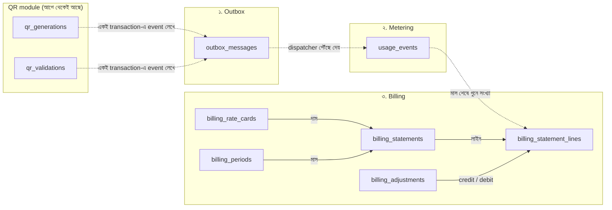
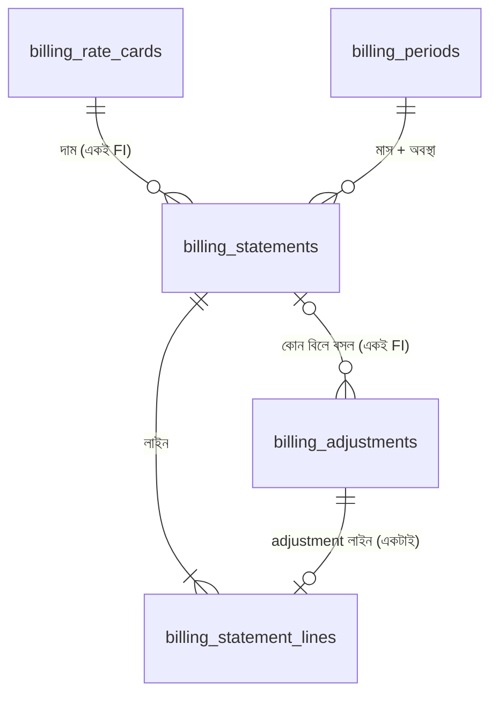

# Database Design — Outbox, Metering ও Billing

- **তারিখ:** 2026-09-30
- **অবস্থা:** Migration লেখা হয়েছে ([`010_outbox.sql`](../../../rvl-secure-bqr-manager/db/migrations/010_outbox.sql), [`011_metering.sql`](../../../rvl-secure-bqr-manager/db/migrations/011_metering.sql), [`012_billing.sql`](../../../rvl-secure-bqr-manager/db/migrations/012_billing.sql)); কোনো code এখনো এগুলো ব্যবহার করে না। SQL file-ই source of truth; এই doc বোঝানোর জন্য।
- **Target:** `rvl-secure-bqr-manager`, database `sbqr_app`, schema `public`। Migration `010`–`012`।
- **ভিত্তি:** [metering-billing-v1-bn.md](metering-billing-v1-bn.md) অংশ ৪.৮, [Metering](metering-tactical-ddd-bn.md) ও [Billing](billing-tactical-ddd-bn.md) tactical model। Repo-তে একই schema: `rvl-secure-bqr-manager/docs/design/database-design.md` section 13।
- **কীভাবে পড়বেন:** প্রথমে "এক নজরে", তারপর প্রতিটি domain। Migration file কীভাবে লেখা, trigger আর grant শেষে পরিশিষ্টে।

---

## এক নজরে

তিনটে domain, ৭টা টেবিল। একটা QR operation বাঁ থেকে ডানে যায়:

**ভরাট তীর** = FK (একই domain-এর ভেতরে)। **ডটেড তীর** = FK নেই, শুধু id বা query (domain-এর সীমানা পেরোয়)।

| Domain | টেবিল | এক কথায় কাজ | কে লেখে | কে পড়ে |
|---|---|---|---|---|
| ১. Outbox | `outbox_messages` | ডাকবাক্স: "QR হয়েছে" খবরটা হারাতে দেয় না | QR module | Dispatcher |
| ২. Metering | `usage_events` | খাতা: প্রতিটি QR operation-এর একটা row, কখনো বদলায় না | Metering handler | Billing, report |
| ৩. Billing | `billing_*` (৫টা) | মাসিক বিল: দাম × সংখ্যা ± adjustment | Billing (ops-এর কাজে) | FI statement, report |

### সব সম্পর্ক এক জায়গায়

| Column | → কোথায় | ধরন | মানে |
|---|---|---|---|
| `outbox_messages.payload.qrGenerationId / qrValidationId` | `qr_generations` / `qr_validations` | id (FK নেই) | কোন QR operation-এর খবর |
| `usage_events.source_id` | `qr_generations` / `qr_validations` | id (FK নেই) | কোন QR operation গোনা হলো। UNIQUE, তাই একটা operation দুবার গোনা যায় না |
| `usage_events.source_event_id` | `outbox_messages` | id (FK নেই) | কোন event থেকে এল; শুধু tracing (outbox row ৭ দিনে মুছে যায়) |
| `usage_events.tenant_id`, `billing_*.tenant_id` | `tenants` | id (FK নেই) | কোন FI; অন্য module-এর টেবিল, তাই FK নয় |
| `billing_statement_lines.quantity` | `usage_events` | কোনো column নয় | মাস শেষে `usage_events` গুনে সংখ্যাটা লেখা হয় |
| `billing_statements (rate_card_id, tenant_id)` | `billing_rate_cards` | **FK** (দুই column) | এই বিল কোন দামে; অন্য FI-র rate card হতে পারে না |
| `billing_statements.period` | `billing_periods` | **FK** | কোন মাসের বিল; বিল Draft না Finalized, তা এই মাসের row বলে |
| `billing_statement_lines.statement_id` | `billing_statements` | **FK** (CASCADE) | কোন বিলের লাইন |
| `billing_statement_lines.adjustment_id` | `billing_adjustments` | **FK**, সব বিল মিলিয়ে UNIQUE | কোন adjustment এই লাইনে; একটা adjustment একটাই লাইনে |
| `billing_adjustments (applied_statement_id, tenant_id)` | `billing_statements` | **FK** (দুই column) | কোন বিলে চূড়ান্তভাবে বসল (NULL = এখনো বসেনি); অন্য FI-র বিলে বসতে পারে না |

### মূল নিয়ম

- PK `uuid` v7, application দেয়। সময় `timestamptz` (UTC); মাস ঠিক হয় Asia/Dhaka-তে।
- টাকা `numeric`: দাম `(18,4)`, অঙ্ক `(18,2)`। Float কখনো নয়।
- অন্য module-এর টেবিলে FK নেই (design ৪.১)।
- যা বদলানো উচিত নয়, DB trigger তা আটকায় (`usage_events`, Finalized বিল)।
- এক FI-র জিনিস অন্য FI-র জিনিসের সাথে জোড়া লাগতে পারে না: FK-তে `tenant_id`-ও থাকে।

---

## Sample data-র গল্প

সব টেবিলের sample একই গল্প থেকে, যাতে এক টেবিলের row অন্য টেবিলে খুঁজে পাওয়া যায়।

- **FI:** `T-A` = Bank A, `T-B` = MFS B, `T-X` = emulator (rate card নেই, তাই বিল হয় না)।
- **মাস:** অক্টোবর ২০২৬। অক্টোবর ৩১ তারিখের পরে ছবিটা (2026-11-02)।
- **সংখ্যা ইচ্ছা করে ছোট**, যাতে `usage_events`-এর row হাতে গুনে বিলের লাইন মেলানো যায়।
- **নম্বর মেলানো:** `ob-6` → `ue-6`, অর্থাৎ একই operation। আসলে সব UUID; এটা শুধু পড়ার সুবিধার জন্য।
- **`↳` চিহ্নের column DB-তে নেই**; শুধু দেখায় row-টা পরের টেবিলে কোথায় গেল।

অক্টোবরে যা ঘটেছে:

| QR operation | কে করেছে | কী | কখন (Dhaka) |
|---|---|---|---|
| `g-1` | T-A | Static QR তৈরি | ৫ অক্টোবর |
| `g-2` | T-A | Dynamic QR তৈরি | **৩১ অক্টোবর ২৩:৫৯:৫৯** (মাসের শেষ সেকেন্ড) |
| `g-3` | T-B | Static QR তৈরি | ১২ অক্টোবর |
| `g-4` | T-B | Dynamic QR তৈরি | ১৩ অক্টোবর |
| `g-5` | T-X | Static QR তৈরি | ২১ অক্টোবর |
| `v-1` | T-B | Validate (T-A-র QR `g-1`) → VALID | ১৫ অক্টোবর |
| `v-2` | T-B | Validate → REQUEST_STALE | ১৫ অক্টোবর |
| `v-3` | T-B | Validate → INVALID_SIGNATURE | ২০ অক্টোবর |
| `v-4` | T-B | Validate → VALID | ২৫ অক্টোবর |
| `v-5` | T-A | Validate → VALID | ২২ অক্টোবর |
| `v-9` | T-A | Validate → KEY_EXPIRED (অজানা verdict) | ২ নভেম্বর |

---

## ১. Outbox

**কাজ:** QR module যে transaction-এ QR লেখে, সেই transaction-এই এখানে একটা event লেখে। তাই QR হলে খবর হারায় না। একটা dispatcher পরে event-টা Metering-এ পৌঁছে দেয়।

### `outbox_messages`

| Column | Type | মানে |
|---|---|---|
| `outbox_message_id` | uuid | **PK**; event-এর id |
| `source_module` | varchar(50) | কে পাঠাল: `qr-generation` / `verification` |
| `event_type` | varchar(150) | `QrGenerated` / `QrValidated` |
| `payload` | jsonb | Event-এর data: QR id, tenant, verdict ইত্যাদি |
| `occurred_at` | timestamptz | ঘটনার সময় |
| `status` | varchar(15) | `PENDING` → `PROCESSED`; বারবার ব্যর্থ হলে `DEAD` |
| `attempts` | integer | কতবার চেষ্টা হলো |
| `next_attempt_at` | timestamptz | পরের চেষ্টা কখন |
| `locked_until` | timestamptz | কোন dispatcher কতক্ষণ ধরে রেখেছে |
| `last_error` | varchar(2000) | শেষ error (PII নয়) |
| `processed_at` | timestamptz | কখন পৌঁছানো শেষ হলো |
| `created_at` | timestamptz | Row তৈরির সময় |

- **নিয়ম:** status শুধু ওই তিনটে; `PROCESSED` হলে `processed_at` লাগবে। `PROCESSED` row ৭ দিনে মুছে যায়।
- **Index:** `PENDING` row খোঁজা (dispatcher); `PENDING`/`DEAD` খোঁজা ("মাসের সব usage পৌঁছেছে?"); পুরনো `PROCESSED` মোছা।

### Sample

সব column নয়, দরকারিগুলো। বোঝার জন্য ৭ দিনের পুরনো row-ও রাখা হয়েছে।

| outbox_message_id | event_type | payload (সংক্ষেপে) | occurred_at (UTC) | status | ↳ usage_event |
|---|---|---|---|---|---|
| `ob-1` | QrGenerated | `g-1`, T-A, STATIC | 2026-10-05 04:00Z | PROCESSED | `ue-1` |
| `ob-2` | QrGenerated | `g-2`, T-A, DYNAMIC | 2026-10-31 17:59:59Z | PROCESSED | `ue-2` |
| `ob-3` | QrGenerated | `g-3`, T-B, STATIC | 2026-10-12 05:00Z | PROCESSED | `ue-3` |
| `ob-4` | QrGenerated | `g-4`, T-B, DYNAMIC | 2026-10-13 05:00Z | PROCESSED | `ue-4` |
| `ob-5` | QrGenerated | `g-5`, T-X, STATIC | 2026-10-21 03:00Z | PROCESSED | `ue-5` |
| `ob-6` | QrValidated | `v-1`, T-B, VALID | 2026-10-15 06:30Z | PROCESSED | `ue-6` |
| `ob-7` | QrValidated | `v-2`, T-B, REQUEST_STALE | 2026-10-15 06:31Z | PROCESSED | `ue-7` |
| `ob-8` | QrValidated | `v-3`, T-B, INVALID_SIGNATURE | 2026-10-20 10:05Z | PROCESSED | `ue-8` |
| `ob-9` | QrValidated | `v-4`, T-B, VALID | 2026-10-25 08:00Z | PROCESSED | `ue-9` |
| `ob-10` | QrValidated | `v-5`, T-A, VALID | 2026-10-22 09:00Z | PROCESSED | `ue-10` |
| `ob-11` | QrValidated | `v-9`, T-A, KEY_EXPIRED | 2026-11-02 09:00Z | **DEAD** (attempts 10) | — |

- `ob-2`: Dhaka-য় ৩১ অক্টোবর ২৩:৫৯:৫৯ = UTC 17:59:59। তাই অক্টোবরের।
- `ob-11`: অজানা verdict, তাই `usage_event` হয়নি। কেউ ঠিক করে requeue না করা পর্যন্ত নভেম্বরের বিল Draft হবে না।

---

## ২. Metering

**কাজ:** প্রতিটি QR operation-এর ঠিক একটা row। এক FI এক মাসে কতটা ব্যবহার করল, তা এখান থেকে গোনা হয়। Row কখনো বদলায় না বা মোছে না।

### `usage_events`

| Column | Type | মানে |
|---|---|---|
| `usage_event_id` | uuid | **PK** |
| `tenant_id` | uuid | কোন FI-র বিলে যাবে (যে request করেছে) |
| `meter_code` | varchar(40) | `GENERATION_STATIC` / `GENERATION_DYNAMIC` / `VALIDATION` |
| `billable` | boolean | বিলে গোনা হবে কি না। লেখার সময়ই ঠিক হয়ে যায় |
| `detail` | varchar(40) | Validation-এর verdict; generation-এ NULL |
| `source_type` | varchar(30) | `qr_generation` / `qr_validation` |
| `source_id` | uuid | কোন QR operation (`g-…` / `v-…`) |
| `source_event_id` | uuid | কোন outbox event থেকে (`ob-…`) |
| `client_reference` | varchar(100) | FI-র নিজের reference (Idempotency-Key / requestId) |
| `occurred_at` | timestamptz | ঘটনার সময়; **এটাই ঠিক করে কোন মাসের বিল** |
| `recorded_at` | timestamptz | Metering-এ পৌঁছানোর সময় |

- **নিয়ম:**
  - `(source_type, source_id)` UNIQUE। একই event দুবার এলে দ্বিতীয়টা চুপচাপ বাদ যায়।
  - Generation হলে verdict নেই আর সবসময় billable। Validation হলে verdict থাকবেই।
  - UPDATE, DELETE, TRUNCATE trigger দিয়ে বন্ধ।
- **Index:** এক FI-র মাসের সংখ্যা (`tenant_id, occurred_at`); সব FI-র মাসের report (`occurred_at`)।

### Sample

| usage_event_id | tenant_id | meter_code | billable | detail | source_id | source_event_id | occurred_at (UTC) | ↳ বিলের কোন লাইনে |
|---|---|---|---|---|---|---|---|---|
| `ue-1` | T-A | GENERATION_STATIC | true | — | `g-1` | `ob-1` | 2026-10-05 04:00Z | `st-1` লাইন 1 |
| `ue-2` | T-A | GENERATION_DYNAMIC | true | — | `g-2` | `ob-2` | 2026-10-31 17:59:59Z | `st-1` লাইন 2 |
| `ue-3` | T-B | GENERATION_STATIC | true | — | `g-3` | `ob-3` | 2026-10-12 05:00Z | `st-2` লাইন 1 |
| `ue-4` | T-B | GENERATION_DYNAMIC | true | — | `g-4` | `ob-4` | 2026-10-13 05:00Z | `st-2` লাইন 2 |
| `ue-5` | T-X | GENERATION_STATIC | true | — | `g-5` | `ob-5` | 2026-10-21 03:00Z | কোথাও না (T-X-এর rate card নেই) |
| `ue-6` | T-B | VALIDATION | true | VALID | `v-1` | `ob-6` | 2026-10-15 06:30Z | `st-2` লাইন 3 |
| `ue-7` | T-B | VALIDATION | **false** | REQUEST_STALE | `v-2` | `ob-7` | 2026-10-15 06:31Z | কোথাও না (billable নয়) |
| `ue-8` | T-B | VALIDATION | true | INVALID_SIGNATURE | `v-3` | `ob-8` | 2026-10-20 10:05Z | `st-2` লাইন 3 |
| `ue-9` | T-B | VALIDATION | true | VALID | `v-4` | `ob-9` | 2026-10-25 08:00Z | `st-2` লাইন 3 |
| `ue-10` | T-A | VALIDATION | true | VALID | `v-5` | `ob-10` | 2026-10-22 09:00Z | `st-1` লাইন 3 |

- `ue-2`: `recorded_at` = 2026-10-31 18:00:02Z, অর্থাৎ Dhaka-য় ১ নভেম্বর। তবু অক্টোবরে গোনা হয়, কারণ মাস ঠিক করে `occurred_at`।
- `ue-6`: QR-টা T-A-র, কিন্তু validate করেছে T-B। তাই বিল T-B-র (ADR 0002)।
- `ue-7`: রেকর্ড হয়, report-এ দেখায়, কিন্তু বিলে গোনা হয় না।

---

## ৩. Billing

### কেন ৫টা টেবিল?

একটা কাগজের বিলের কথা ভাবুন। প্রতিটি টেবিল একটা প্রশ্নের উত্তর দেয়:

| টেবিল | কোন প্রশ্নের উত্তর | কাগজে যা | বাদ দিলে কী সমস্যা |
|---|---|---|---|
| `billing_rate_cards` | এই FI-র দাম কত, কোন মাস থেকে? | দামের তালিকা | দাম বদলালে পুরনো মাস কোন দামে হিসাব হবে, জানা যায় না |
| `billing_periods` | এই মাসের বিল কোন অবস্থায় (Draft / Finalized)? | মাসের খাতার মলাট | অবস্থা প্রতিটি বিলে আলাদা থাকলে "সব FI-র বিল একসাথে Finalize" আর দুজন একসাথে হিসাব করা আটকানো কঠিন |
| `billing_statements` | এই FI-র এই মাসের মোট কত? | বিলের মাথা (মোট টাকা) | প্রতি FI-র বিল বলে কিছু থাকে না |
| `billing_statement_lines` | মোটটা কীভাবে এল? | বিলের ভেতরের লাইন | FI জানতে পারে না কোন কাজের জন্য কত টাকা |
| `billing_adjustments` | হাতে দেওয়া credit / debit কোনটা, আর কোন বিলে বসল? | আলাদা credit note | Finalized বিল বদলানো যায় না; ভুল ঠিক করার আর কোনো উপায় থাকে না |

**একটা বিল কীভাবে তৈরি হয় (মাস শেষে, Draft):**

1. `billing_periods`-এ মাসের row তৈরি (`DRAFT`)।
2. প্রতিটি FI-র জন্য: `billing_rate_cards` থেকে ওই মাসের দাম।
3. `usage_events` গুনে meter অনুযায়ী সংখ্যা → প্রতিটি meter-এর জন্য একটা USAGE লাইন।
4. FI-র Pending `billing_adjustments` → প্রতিটির জন্য একটা ADJUSTMENT লাইন।
5. লাইন যোগ করে `billing_statements`-এর মোট।

**Finalize:** মাসের row `FINALIZED` হয়, adjustment-গুলো `Applied` হয়। বিলের নিজের কোনো status নেই: মাস Finalized মানে সেই মাসের সব বিল Finalized। এরপর কিছুই বদলায় না।

### `billing_rate_cards` — দামের তালিকা

| Column | Type | মানে |
|---|---|---|
| `rate_card_id` | uuid | **PK** |
| `tenant_id` | uuid | কোন FI |
| `effective_from` | date | কোন মাস থেকে (সবসময় মাসের ১ তারিখ) |
| `generation_rate` | numeric(18,4) | প্রতি QR তৈরির দাম (BDT) |
| `validation_rate` | numeric(18,4) | প্রতি validation-এর দাম (BDT) |
| `currency` | char(3) | `BDT` |
| `created_by`, `created_at` | varchar(200), timestamptz | কে, কখন |

- **নিয়ম:** `(tenant_id, effective_from)` UNIQUE। দাম ≥ 0। বদলানো যায় না; নতুন দাম = নতুন row। কার্যকর হওয়ার আগে পর্যন্ত মোছা যায়।
- `(rate_card_id, tenant_id)`-ও UNIQUE। এটা নতুন কোনো নিয়ম নয় (PK তো আছেই); শুধু দরকার যাতে statement দুই column দিয়ে FK বানাতে পারে।
- **কোন মাসে কোন দাম:** ওই মাসের ১ তারিখ বা তার আগের সবচেয়ে নতুন row।

| rate_card_id | tenant_id | effective_from | generation_rate | validation_rate |
|---|---|---|---|---|
| `rc-1` | T-A | 2026-08-01 | 0.2500 | 0.1000 |
| `rc-2` | T-A | 2026-11-01 | 0.2000 | 0.1000 |
| `rc-3` | T-B | 2026-10-01 | 0.3000 | 0.1250 |

- অক্টোবরে T-A-র দাম `rc-1`, কারণ `rc-2` নভেম্বর থেকে।
- T-X-এর কোনো row নেই, তাই T-X-এর বিল হয় না।

### `billing_periods` — মাসের অবস্থা

| Column | Type | মানে |
|---|---|---|
| `period` | char(7) | **PK**; `YYYY-MM` (Dhaka মাস) |
| `status` | varchar(15) | `DRAFT` → `FINALIZED` |
| `drafted_at` | timestamptz | কখন Draft হলো |
| `finalized_at`, `finalized_by` | timestamptz, varchar(200) | কে, কখন Finalize করল |

- **নিয়ম:** মাসে একটাই row। Finalized হলে `finalized_at/by` লাগবে, আর row বদলানো যায় না।
- **এই `status`-ই মাসের সব বিলের অবস্থা।** মাস Finalized হলে সেই মাসের বিল, লাইন বা adjustment আর বদলানো যায় না (trigger)।
- Recalculate আর Finalize এই row-টা lock করে, তাই একই মাসে দুটো কাজ একসাথে চলে না।

| period | status | drafted_at | finalized_at | finalized_by |
|---|---|---|---|---|
| 2026-09 | FINALIZED | 2026-09-30 20:00Z | 2026-10-03 05:30Z | finance-ops |
| 2026-10 | DRAFT | 2026-10-31 20:00Z | — | — |

- নভেম্বরের row নেই, অর্থাৎ মাস এখনো চলছে।

### `billing_statements` — প্রতি FI-র মাসিক বিল

| Column | Type | মানে |
|---|---|---|
| `statement_id` | uuid | **PK** |
| `tenant_id` | uuid | কোন FI |
| `period` | char(7) | **FK** → `billing_periods`। বিলের অবস্থা এই মাসের `status` থেকে |
| `rate_card_id` | uuid | **FK** `(rate_card_id, tenant_id)` → `billing_rate_cards`; একই FI-র rate card হতেই হবে |
| `generation_rate`, `validation_rate` | numeric(18,4) | দামের কপি (পরে rate card বদলালেও বিল বদলায় না) |
| `subtotal` | numeric(18,2) | USAGE লাইনের যোগফল |
| `adjustments_total` | numeric(18,2) | ADJUSTMENT লাইনের যোগফল |
| `total` | numeric(18,2) | `subtotal + adjustments_total`; credit বেশি হলে ঋণাত্মক |
| `currency` | char(3) | `BDT` |
| `calculated_at` | timestamptz | শেষ হিসাবের সময় |

- **নিয়ম:**
  - প্রতি মাসে প্রতি FI-র একটাই বিল (`period, tenant_id` UNIQUE)।
  - মাস Finalized হলে বিল বদলানো বা মোছা যায় না, আর সেই মাসে নতুন বিলও ঢোকে না।
  - `(statement_id, tenant_id)` UNIQUE, যাতে adjustment দুই column দিয়ে FK বানাতে পারে।
- **`status` column নেই কেন:** নিয়ম হলো মাসের সব বিল একসাথে Draft ও একসাথে Finalize হয় (design ১৪.৩)। আলাদা status থাকলে দুটো জায়গায় একই তথ্য থাকত, আর মিল না থাকার ঝুঁকি থাকত। কোনো একটা FI-র বিল আলাদা করে Finalize করার দরকার হলে তবেই column ফিরিয়ে আনতে হবে।

| statement_id | tenant_id | period | rate_card_id | subtotal | adjustments_total | total | ↳ অবস্থা (মাস থেকে) |
|---|---|---|---|---|---|---|---|
| `st-0` | T-A | 2026-09 | `rc-1` | 1.00 | 0.25 | 1.25 | FINALIZED |
| `st-1` | T-A | 2026-10 | `rc-1` | 0.60 | -0.10 | 0.50 | DRAFT |
| `st-2` | T-B | 2026-10 | `rc-3` | 0.98 | 0.00 | 0.98 | DRAFT |

- `st-1` (T-A) শুধু T-A-র rate card (`rc-1`, `rc-2`) নিতে পারে। `st-1`-এ `rc-3` (T-B-র) বসালে FK error দেয়।
- T-X-এর বিল নেই (rate card নেই)।
- `st-0`-এর লাইন এখানে দেখানো হয়নি।

### `billing_statement_lines` — বিলের লাইন

| Column | Type | মানে |
|---|---|---|
| `statement_id` | uuid | **PK** (১ম অংশ); **FK** → `billing_statements`। বিল মুছলে লাইনও মোছে |
| `line_no` | integer | **PK** (২য় অংশ) |
| `line_type` | varchar(15) | `USAGE` (ব্যবহার) / `ADJUSTMENT` (হাতে দেওয়া) |
| `meter_code` | varchar(40) | USAGE হলে কোন meter |
| `adjustment_id` | uuid | ADJUSTMENT হলে **FK** → `billing_adjustments`; সব বিল মিলিয়ে একবারই |
| `description` | varchar(200) | বিলে যা লেখা থাকবে |
| `quantity` | bigint | কয়টা (USAGE) |
| `unit_rate` | numeric(18,4) | প্রতিটির দাম (USAGE) |
| `amount` | numeric(18,2) | USAGE: `round(quantity × unit_rate, 2)`। ADJUSTMENT: adjustment-এর অঙ্ক |

- **নিয়ম:**
  - এক বিলে একটা meter একবারই।
  - একটা adjustment **সব বিল মিলিয়ে** একটাই লাইনে (partial unique index)। তাই একই credit দুটো বিলে বা দুই মাসে ঢুকতে পারে না।
  - Adjustment লাইনের adjustment আর বিল একই FI-র হতে হবে (trigger)।
  - লাইন কখনো UPDATE হয় না; Recalculate মানে সব লাইন মুছে নতুন লেখা। Finalized মাসের লাইন ছোঁয়া যায় না।

| statement_id | line_no | line_type | meter_code | adjustment_id | quantity | unit_rate | amount | ↳ কোথা থেকে |
|---|---|---|---|---|---|---|---|---|
| `st-1` | 1 | USAGE | GENERATION_STATIC | — | 1 | 0.2500 | 0.25 | `ue-1` |
| `st-1` | 2 | USAGE | GENERATION_DYNAMIC | — | 1 | 0.2500 | 0.25 | `ue-2` |
| `st-1` | 3 | USAGE | VALIDATION | — | 1 | 0.1000 | 0.10 | `ue-10` |
| `st-1` | 4 | ADJUSTMENT | — | `adj-1` | 0 | 0 | -0.10 | `adj-1` |
| `st-2` | 1 | USAGE | GENERATION_STATIC | — | 1 | 0.3000 | 0.30 | `ue-3` |
| `st-2` | 2 | USAGE | GENERATION_DYNAMIC | — | 1 | 0.3000 | 0.30 | `ue-4` |
| `st-2` | 3 | USAGE | VALIDATION | — | 3 | 0.1250 | 0.38 | `ue-6`, `ue-8`, `ue-9` (`ue-7` বাদ: billable নয়) |

- `st-2` লাইন 3: 3 × 0.125 = 0.375, rounding-এ 0.38। Rounding প্রতি লাইনে একবার, তারপর যোগ।
- মেলান: `st-1` = 0.25 + 0.25 + 0.10 − 0.10 = **0.50**; `st-2` = 0.30 + 0.30 + 0.38 = **0.98**।

### `billing_adjustments` — হাতে দেওয়া credit / debit

| Column | Type | মানে |
|---|---|---|
| `adjustment_id` | uuid | **PK** |
| `tenant_id` | uuid | কোন FI |
| `amount` | numeric(18,2) | ধনাত্মক = বাড়তি চার্জ, ঋণাত্মক = credit; 0 নয় |
| `reason` | varchar(500) | কেন (বাধ্যতামূলক) |
| `created_by`, `created_at` | varchar(200), timestamptz | কে, কখন |
| `applied_statement_id` | uuid | **FK** `(applied_statement_id, tenant_id)` → `billing_statements`। NULL = Pending; Finalize হলে সেই বিলের id। বিলটা একই FI-র হতেই হবে |

- **নিয়ম:** মোছা বা বদলানো যায় না; ভুল হলে উল্টো অঙ্কের নতুন adjustment। `applied_statement_id` শুধু একবার NULL থেকে মান পায়। T-A-র adjustment T-B-র বিলে বসালে FK error দেয়।

| adjustment_id | tenant_id | amount | reason | applied_statement_id |
|---|---|---|---|---|
| `adj-0` | T-A | 0.25 | আগস্টের ১টা late generation (1 × 0.25) | `st-0` (Applied) |
| `adj-1` | T-A | -0.10 | Credit: সেপ্টেম্বরে ১টা validation ভুলভাবে বিলে গেছে | — (Pending) |

- `adj-0` সেপ্টেম্বরের বিল `st-0`-এ বসে গেছে; তাই `st-0`-এর `adjustments_total` = 0.25।
- `adj-1` অক্টোবরের Draft বিলে লাইন হিসেবে আছে (`st-1` লাইন 4), কিন্তু এখনো Pending। অক্টোবর Finalize হলে `applied_statement_id` = `st-1`।

### অক্টোবর Finalize হলে (এক transaction-এ)

1. Ops স্ক্রিনে মোট দেখেছে 0.50 + 0.98 = **1.48** (`expectedTotal`)। নতুন হিসাব না মিললে Finalize হয় না (409 `DRAFT_CHANGED`)।
2. `adj-1.applied_statement_id` = `st-1` (দুটোই T-A, তাই FK মেনে নেয়)।
3. `2026-10` → `FINALIZED`। এক row বদলালেই `st-1`, `st-2` আর তাদের লাইন Finalized হয়ে যায়।
4. `audit_logs`-এ `billing.period.finalized`।

ক্রম জরুরি: adjustment আগে, মাস পরে। মাস Finalized হওয়ার পরে অক্টোবরের বিল, লাইন বা adjustment বদলাতে গেলে trigger error দেয়।

---

## পরিশিষ্ট ক: Migration file

পুরো SQL এখানে কপি করা নেই, যাতে দুই জায়গায় আলাদা না হয়ে যায়। সরাসরি file দেখুন:

| File | কী আছে |
|---|---|
| [`010_outbox.sql`](../../../rvl-secure-bqr-manager/db/migrations/010_outbox.sql) | `outbox_messages`, 3টা partial index, `forbid_mutation_any()` |
| [`011_metering.sql`](../../../rvl-secure-bqr-manager/db/migrations/011_metering.sql) | `usage_events`, dedup UNIQUE, 2টা index, append-only trigger |
| [`012_billing.sql`](../../../rvl-secure-bqr-manager/db/migrations/012_billing.sql) | ৫টা billing টেবিল, দুই-column FK, partial unique index, trigger |

**File-গুলো কীভাবে লেখা (নিরাপত্তার জন্য):**

- `CREATE TABLE IF NOT EXISTS`-এ শুধু column আর PK।
- বাকি সব constraint (UNIQUE, FK, CHECK) `ALTER TABLE ... ADD CONSTRAINT` দিয়ে, **শুধু না থাকলে**। Helper: `pg_temp.add_constraint_if_missing` (session-এর temp function, schema-য় কিছু থাকে না)।
- কেন drop করে আবার add নয়: প্রতিবার deploy-এ সব file আবার চলে। Drop + add করলে বড় `usage_events` প্রতিবার পুরো scan হতো, আর lock থাকত। কোনো constraint বদলাতে হলে নতুন নম্বরের migration লিখতে হবে, এই file বদলানো নয়।
- পুরো file এক transaction-এ (`BEGIN … COMMIT`); দুবার চালালেও একই ফল।
- `001`–`012` পুরো chain PostgreSQL 16-এ দুবার চালিয়ে, sample data দিয়ে ওপরের সব নিয়ম পরীক্ষা করা হয়েছে।

**Trigger (Finalized হলে বদল বন্ধ):**

| টেবিল | নিয়ম |
|---|---|
| `billing_rate_cards` | UPDATE নিষেধ। DELETE শুধু `effective_from` Dhaka-র আজকের পরে হলে |
| `billing_periods` | `FINALIZED` row-এ UPDATE / DELETE নিষেধ |
| `billing_statements` | মাস `FINALIZED` হলে INSERT / UPDATE / DELETE নিষেধ |
| `billing_statement_lines` | UPDATE সবসময় নিষেধ। মাস `FINALIZED` হলে INSERT / DELETE নিষেধ। Adjustment লাইনের adjustment আর বিল একই FI-র |
| `billing_adjustments` | DELETE নিষেধ। UPDATE শুধু `applied_statement_id` NULL → মান, একবার; সেই বিলেই এর লাইন থাকতে হবে, আর বিলের মাস তখনো `FINALIZED` নয় |
| `usage_events`, সব `billing_*` | TRUNCATE নিষেধ (`usage_events`-এ UPDATE / DELETE-ও) |

মাসের অবস্থা পড়ার সময় trigger `FOR SHARE` lock নেয়। Finalize চললে অন্য transaction অপেক্ষা করে, তারপর `FINALIZED` দেখে।

**Grant (`sbqr_app_runtime`):** প্রতিটি file-এ আছে, তবে শুধু role থাকলে চলে (roles migration এখনো নেই)।

| টেবিল | অধিকার |
|---|---|
| `outbox_messages` | SELECT, INSERT, UPDATE, DELETE |
| `usage_events` | SELECT, INSERT |
| `billing_rate_cards` | SELECT, INSERT, DELETE |
| `billing_periods` | SELECT, INSERT, UPDATE (`FOR UPDATE` / `FOR SHARE`-এ UPDATE লাগে) |
| `billing_statements` | SELECT, INSERT, UPDATE, DELETE |
| `billing_statement_lines` | SELECT, INSERT, DELETE |
| `billing_adjustments` | SELECT, INSERT, UPDATE |

**Integration test:** Respawn প্রতিটি টেবিলে DELETE চালিয়ে DB reset করে। `usage_events`-এর statement-level trigger খালি টেবিলেও error দেয়, তাই তিনটে test project-এর `RespawnConfig`-এ `audit_logs`-এর পাশে `usage_events`-ও ignore করা হয়েছে।

---

## পরিশিষ্ট খ: design ৪.৮-এর তুলনায় বদল

সবই সংকীর্ণ করা বা যোগ; কোনো নিয়ম আলগা হয়নি।

| # | বদল | কেন |
|---|---|---|
| 1 | Constraint / index-এর নাম `pk_`, `uq_`, `fk_`, `ck_`, `ix_` | বিদ্যমান migration-এর নিয়ম |
| 2 | `outbox_messages`: `attempts`, `processed_at`-এর CHECK | ভুল অবস্থা DB-তে আটকায় |
| 3 | `usage_events`: shape CHECK | Generation-এ verdict বা non-billable ঢুকতে পারে না |
| 4 | `usage_events`-এর index-এ `usage_event_id` ও `detail` | Raw extract-এর paging; verdict breakdown index থেকেই |
| 5 | `billing_periods`: format CHECK; Finalized হলে `finalized_at/by` বাধ্যতামূলক | কে Finalize করল, তা হারায় না |
| 6 | `billing_statements`: UNIQUE `(period, tenant_id)`; `total` CHECK | মাসের সব বিল load-এও কাজে লাগে |
| 7 | `billing_statement_lines`: `adjustment_id` FK, shape CHECK, প্রতি বিলে meter একবার | একই meter দুবার গোনা যায় না |
| 8 | লাইনে UPDATE সবসময় নিষেধ | Recalculate মানে মুছে নতুন লেখা |
| 9 | `ix_billing_adjustments_pending` | Draft-এ Pending adjustment খোঁজা |
| 10 | Rate card DELETE guard-এ Dhaka তারিখ | `current_date` session timezone-এ চলে |
| 11 | সব `billing_*`-এ TRUNCATE guard | Row trigger TRUNCATE ধরে না |
| 12 | Statement → rate card FK দুই column `(rate_card_id, tenant_id)`; rate card-এ `uq_billing_rate_cards_id_tenant` | অন্য FI-র দামে বিল DB-তেই আটকায়, শুধু app-এর ভরসায় নয় |
| 13 | Adjustment → statement FK দুই column `(applied_statement_id, tenant_id)`; statement-এ `uq_billing_statements_id_tenant` | এক FI-র credit অন্য FI-র বিলে বসে না |
| 14 | `uq_billing_statement_lines_adjustment`: `(statement_id, adjustment_id)` → partial unique `(adjustment_id) WHERE NOT NULL` | একই adjustment দুটো বিলে (দুই FI বা দুই মাস) ঢোকে না |
| 15 | `billing_statements.status` বাদ; অবস্থা আসে `billing_periods.status` থেকে; statement ও line-এর trigger মাসের অবস্থা দেখে (`FOR SHARE`) | নিয়মটাই "মাসের সব বিল একসাথে Finalize" (design ১৪.৩); একই তথ্য দুই জায়গায় থাকলে মিল না থাকার ঝুঁকি |
| 16 | Line trigger: adjustment লাইনের FI = বিলের FI। Adjustment trigger: Applied শুধু সেই বিলে যেখানে এর লাইন আছে, আর মাস Finalized হওয়ার আগে | Draft-এও FI মেলে; Finalize-এর পরে কোনো adjustment পুরনো বিলে চুপচাপ ঢোকে না |

## পরিশিষ্ট গ: খোলা বিষয় (schema বদলাতে পারে)

যেকোনোটা গৃহীত হলে নতুন নম্বরের migration লাগবে (`013`…), `010`–`012` বদলানো নয়।

| # | বিষয় | Schema-তে প্রভাব |
|---|---|---|
| 1 | Billing Open Question ২: row না থাকা মানেই Open? | হ্যাঁ হলে status থেকে `'OPEN'` বাদ |
| 2 | C4: অফবোর্ড হওয়া FI-র শুধু-adjustment বিল | গৃহীত হলে `billing_statements.rate_card_id` nullable। দুই-column FK তখনো চলে (NULL হলে check হয় না) |
| 3 | F15: Price list + Billing account | গৃহীত হলে `billing_rate_cards` বদলাবে |
| 4 | `usage_events` retention (≥ ১৩ মাস) | Trigger DELETE আটকায়; purge লাগলে owner role দিয়ে আলাদা, audited কাজ |
| 5 | Roles-and-grants migration | এখনো নেই। ততদিন `010`–`012` role থাকলে নিজেরাই grant দেয় |
| 6 | কোনো FI-র বিল আলাদা করে Finalize করা (এখন দরকার নেই) | দরকার হলে `billing_statements.status` ফেরত আনতে হবে, trigger-ও বদলাবে |
| 7 | `billing_accounts` (এক FI-র একাধিক billing entity, বা কয়েকটা FI মিলে এক বিল) | এখন দরকার নেই, তাই নেই। F15 গৃহীত হলে ভাবা হবে |
