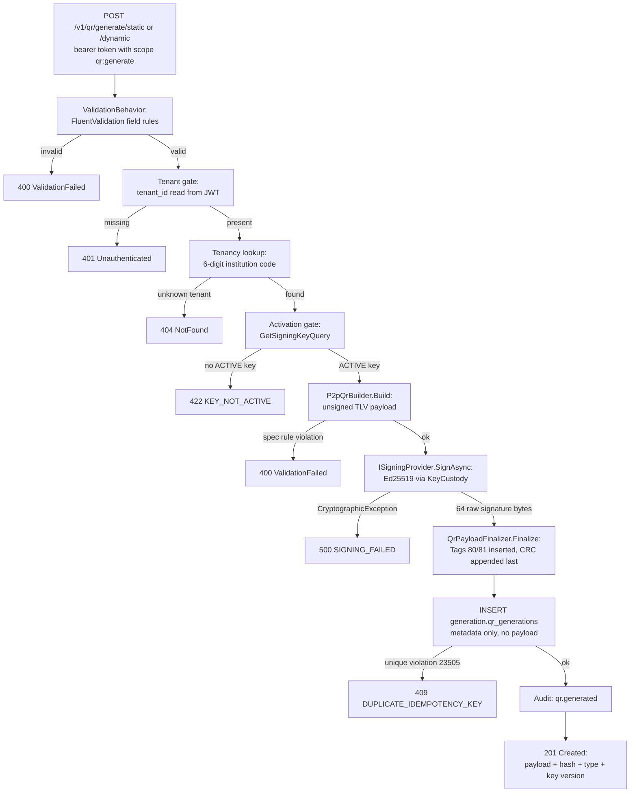
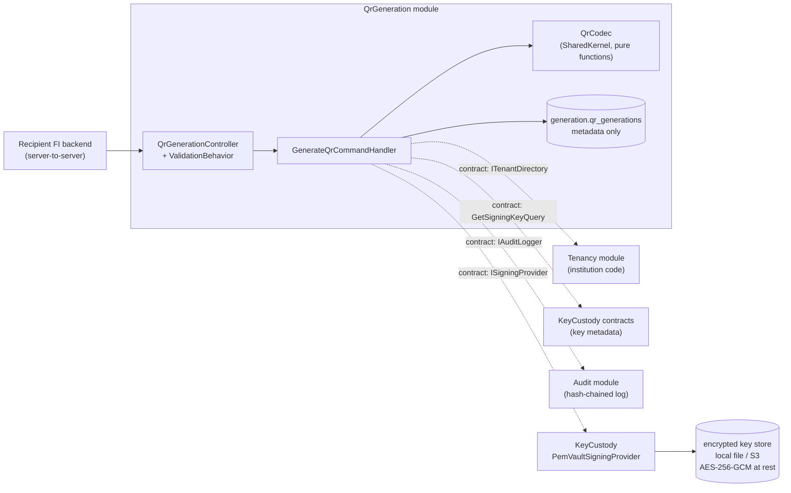

# QR Generation & Signing — How It Actually Works

*A plain-language walkthrough of the BanglaQR P2P payload generation and signing
feature, for engineers who are new to this codebase and new to DDD. No prior
context assumed. If you read nothing else, read §1 and §6.*

- **Feature scope:** `POST /v1/qr/generate/static` and `POST /v1/qr/generate/dynamic`
- **Requirements:** [`docs/requirements/2026-09-10-qr-generation.md`](requirements/2026-09-10-qr-generation.md) (FR ids R1–R13 referenced below)
- **Spec:** [`docs/bb-banglaqr-p2p-specification.md`](bb-banglaqr-p2p-specification.md) (§2.3 tag tables, §2.5 signature rules)
- **Constraints:** [`docs/security-constraints.md`](security-constraints.md) (ids like C5, A9 referenced below)

---

## 1. TL;DR — what happens when someone asks for a QR

A Recipient Financial Institution (RFI) — a *tenant* of this platform — calls one
of the two generate endpoints with a bearer token. The platform then runs one
straight, linear pipeline:

1. **Validate** the request body (FluentValidation). Bad input → 400, nothing else happens.
2. **Identify the tenant** from the JWT — never from the request body.
3. **Check the tenant exists** and has a registered 6-digit institution code. Unknown → 404.
4. **Check the tenant has an ACTIVE signing key** (the *activation gate*). No key → 422 `KEY_NOT_ACTIVE`.
5. **Build the unsigned QR payload** — the EMVCo TLV string, tag by tag, per the BanglaQR spec.
6. **Sign** exactly `recipientName + recipientPan` (UTF-8 bytes, no separator) with the tenant's Ed25519 private key, fetched from the encrypted key vault. Signing failure → reject, no partial artifact.
7. **Finalize the payload** — insert the Base64 signature into Tags 80/81, then compute the CRC **last** and append it as Tag 63.
8. **Persist a metadata row** (no payload bytes, no payload hash — the QR string is never stored) and **write an audit line** `qr.generated`.
9. **Return 201** with the signed payload string, its SHA-256 hash, the QR type, and the key version used.

The whole story lives in **one method**: `GenerateQrCommandHandler.Handle`
(`src/Modules/QrGeneration/SBQR.Modules.QrGeneration.Application/Commands/GenerateQrCommandHandler.cs:119`).
If you understand that method top to bottom, you understand the feature.

**The security model in one sentence:** the caller can only ever say *who the
recipient is*; *who is issuing* is determined by the platform from the
authenticated tenant, and *the private key never leaves KeyCustody* — the QR
module never sees key material, only a 64-byte signature.

---

## 2. The cast — who does what

| Component | File | One-line responsibility |
|---|---|---|
| `QrGenerationController` | `src/Modules/QrGeneration/SBQR.Modules.QrGeneration.Api/Controllers/QrGenerationController.cs` | HTTP surface; wraps the body into a command; maps `Result` → status code |
| `GenerateStaticQrValidator` / `GenerateDynamicQrValidator` | `.../Commands/GenerateQrCommand.cs:65` | Field rules (lengths, amount pattern) — run *before* the handler via `ValidationBehavior` |
| `GenerateStaticQrCommandHandler` / `GenerateDynamicQrCommandHandler` | `.../Commands/GenerateQrCommandHandler.cs:20,53` | Thin adapters: translate the two public commands into one internal command with `IsDynamic` true/false |
| `GenerateQrCommandHandler` (internal) | `.../Commands/GenerateQrCommandHandler.cs:91` | **The pipeline.** Orchestrates steps 2–8 of §1 |
| `P2pQrBuilder` | `src/SharedKernel/SBQR.SharedKernel/QrCodec/P2pQrBuilder.cs:44` | Pure function: validated input → unsigned TLV string (business tags only) |
| `QrPayloadFinalizer` | `src/SharedKernel/SBQR.SharedKernel/QrCodec/QrPayloadFinalizer.cs:30` | Pure function: inserts signature Tags 80/81, appends CRC **last** |
| `TlvTokenizer`, `Crc16CcittFalse`, `SignaturePayload`, `Utf8Length` | `src/SharedKernel/SBQR.SharedKernel/QrCodec/` | TLV encode/parse, CRC-16/CCITT-FALSE, `name+pan` signature bytes, UTF-8 byte counting |
| `ISigningProvider` → `PemVaultSigningProvider` | contract `src/SharedKernel/SBQR.SharedKernel/Cryptography/ISigningProvider.cs`, impl `src/Modules/KeyCustody/.../Custody/PemVaultSigningProvider.cs:40` | Loads the tenant's ACTIVE encrypted key, unwraps it in memory, Ed25519-signs |
| `GetSigningKeyQuery` | `src/Modules/KeyCustody/SBQR.Modules.KeyCustody.Contracts/GetSigningKeyQuery.cs` | The activation gate's data source — key **metadata only**, never key material |
| `ITenantDirectory` | `src/Modules/Tenancy/SBQR.Modules.Tenancy.Contracts/ITenantDirectory.cs` | Resolves tenant id → 6-digit institution code |
| `ICurrentTenant` | `src/SharedKernel/SBQR.SharedKernel/Application/ICurrentTenant.cs` (impl `src/Host/SBQR.Api/Infrastructure/JwtClaimCurrentTenant.cs`) | Reads `tenant_id` from the JWT claim |
| `IAuditLogger` | `src/SharedKernel/SBQR.SharedKernel/Application/IAuditLogger.cs` (impl in Audit module) | Appends a hash-chained row to `audit.audit_logs` |
| `generation.qr_generations` | `db/migrations/003_generation.sql` | Append-only metadata table — one row per successful generation |

---

## 3. The flow, step by step

Walking through it with the code:

1. **HTTP entry.** Both endpoints live on one controller, class-level
   `[Authorize(Policy = PolicyNames.QrGenerate)]` — a client-credentials token
   with scope `qr:generate`, obtained from `POST /v1/oauth/token`
   (`QrGenerationController.cs:26`). The controller itself does almost nothing:
   it wraps the body into `GenerateStaticQrCommand` / `GenerateDynamicQrCommand`
   and hands it to MediatR.

2. **Validation first.** A MediatR pipeline behavior (`ValidationBehavior` in
   SharedKernel) runs the FluentValidation validators before any handler code.
   This is where "Name too long", "amount not numeric" etc. die with a 400 —
   before any tenant, key or crypto work happens (A6: validation is 100%
   server-side).

3. **Two commands collapse into one.** The static and dynamic handlers
   (`GenerateQrCommandHandler.cs:20` and `:53`) are five-line adapters that fill
   in `IsDynamic: false/true` and forward the internal `GenerateQrCommand`. All
   real logic is single-shape — static vs dynamic is literally **one bool**
   (see §5).

4. **Tenant identity — from the token, never the body.** `ICurrentTenant`
   reads the `tenant_id` JWT claim; a missing claim is `Guid.Empty` and the
   request dies with 401 (`GenerateQrCommandHandler.cs:123-128`). The handler
   then resolves the tenant's 6-digit institution code via `ITenantDirectory`
   (`:130-135`). This is the anti-spoofing core: **a tenant cannot claim to be
   another institution**, because the institution identity is stamped in by the
   platform from the authenticated tenant record (C5).

5. **The activation gate.** `GetSigningKeyQuery` returns the tenant's
   highest-version key row — metadata only (status, version). If there is no
   row, or its status is anything other than `ACTIVE`, the request dies with
   422 `KEY_NOT_ACTIVE` (`GenerateQrCommandHandler.cs:140-147`). There is no
   fallback, no "try anyway", no debug mode (A1: never fail open). This also
   implements the product rule that a tenant must mint its first key before it
   can issue any QR.

6. **Build the unsigned payload.** `P2pQrBuilder.Build` (`P2pQrBuilder.cs:44`)
   re-validates the spec rules (Table 3A/3B/4A: institution type 00–05,
   institution id exactly 4 digits, UTF-8 byte caps per field) and then emits
   the TLV string in **strictly ascending tag order** (`:167-169`) — the output
   is deterministic regardless of input ordering (A4). It also computes the
   exact bytes to be signed: `SignaturePayload.Reconstruct(name, pan)` = UTF-8
   of `name + pan`, concatenated with no separator, per spec §2.5.

7. **Sign through the boundary.** The handler calls
   `ISigningProvider.SignAsync(build.Value.SignaturePayloadBytes)` — the only
   interaction QR generation ever has with key material. Inside KeyCustody,
   `PemVaultSigningProvider.SignAsync` (`PemVaultSigningProvider.cs:60`):
   - re-resolves the tenant from `ICurrentTenant` (defense in depth — the
     signer trusts no caller assertion),
   - loads the tenant's ACTIVE `crypto_keys` row (`:71-77`),
   - loads the AES-256-GCM-encrypted private key from the key store by custody
     handle (`:83-86`),
   - unwraps it **in memory only**, parses the PKCS#8 PEM, imports the 32-byte
     seed into NSec's locked `SecureMemory`, and signs with Ed25519 (`:93-99`),
   - wipes the buffers on every exit path (`:101-104`).

   Any failure on this path throws `CryptographicException`, which the handler
   converts to a rejection — `SIGNING_FAILED`, no payload leaves the building
   (`GenerateQrCommandHandler.cs:167-178`). The key never leaves KeyCustody and
   never appears in a response or log (C17, C19).

8. **Finalize — CRC last, by construction.** `QrPayloadFinalizer.Finalize`
   (`QrPayloadFinalizer.cs:30`) takes the 88-character Base64 signature
   (64 raw Ed25519 bytes → Base64), splits it 44/44 into Tag 80 and Tag 81
   templates, and only then computes the CRC-16/CCITT-FALSE over everything up
   to and including the literal `6304` and appends the 4 hex chars. The design
   makes the "CRC must be computed last" rule **impossible to violate**: the
   finalizer *throws* if handed a partial payload that already contains tags
   ≥ 80 (`:45-50`). Rules enforced by structure beat rules enforced by comments.

9. **Persist metadata, not the payload.** One row in
   `generation.qr_generations`: id, tenant, `STATIC`/`DYNAMIC`, the signing
   key's version, the optional idempotency key
   (`GenerateQrCommandHandler.cs:189-200`). The payload string and its hash are
   deliberately **not stored** (decision log 2026-09-08): integrity of a QR is
   carried by its own signature + CRC, and "not persisted" also means "cannot
   be replayed from our database".

10. **Idempotency is the database's job.** If the caller sent an
    `Idempotency-Key` header, a tenant-scoped **partial unique index**
    (`db/migrations/003_generation.sql:48-50`) rejects the duplicate insert with
    Postgres error 23505, mapped to 409 `DUPLICATE_IDEMPOTENCY_KEY`
    (`GenerateQrCommandHandler.cs:202-209`). The race between two concurrent
    retries is closed by the database engine, not by application logic (A9) —
    application-level checks always have a race window; unique constraints do not.

11. **Audit, then respond.** One audit row `qr.generated` with actor
    `tenant:{institutionCode}`, the payload hash as resource id, and metadata
    `{qr_type, key_version, institution_code}` (`:211-223`) — enough to answer
    "who issued what, signed with which key version" without ever logging the
    payload, PAN, or key material (C19). Then 201 with
    `{ QrPayload, PayloadHash, QrType, SignatureKeyVersion }`.

### Module boundaries on this path

The feature touches four modules, and it can only talk to them through their
**contracts** (public interfaces in each module's `.Contracts` project) — never
by reaching into another module's database tables or internals:

Dashed arrows are contract calls; the only solid data flow inside the QR module
is controller → handler → codec → its own table. A QR-payload string signed by
this flow is later verified by the **Verification** module (different endpoint,
`POST /v1/qr/validate`), which resolves the sender's public key either from our
own KeyCustody or from the InstitutionTrust directory — that's outside this
document's scope.

---

## 4. Anatomy of the payload string

The QR payload is one long string in **EMVCo TLV** format. TLV = Tag, Length,
Value: every field is `[2-digit tag][2-digit length][value]`, where **length
counts UTF-8 bytes, not characters** — that's why `Utf8Length` exists and why
Bangla text in names/cities works correctly (one Bangla letter is 3 UTF-8
bytes).

Reading one field: `5911RAHIM UDDIN` → tag `59` (recipient name), length `11`
(bytes), value `RAHIM UDDIN`.

For a tenant with institution code `031008` (type `03`, id `1008`), a dynamic
QR with amount `1500.00` produces (conceptually — signature shown as `…`):

| Tag | Meaning | Value here | Notes |
|---|---|---|---|
| 00 | Payload format indicator | `01` | fixed |
| 01 | Point of initiation | `12` dynamic / `11` static | **the** static-vs-dynamic bit |
| 26 | Recipient account template | sub-TLVs below | who gets paid |
| — 26·00 | Network GUID | `bd.org.bb.npsb` | fixed |
| — 26·01 | Institution type | `03` | from tenant record |
| — 26·02 | Institution id | `1008` | from tenant record |
| — 26·03 | Recipient PAN | `1234567890123456789` | from request, ≤19 bytes |
| 52 | Merchant category code | `4829` | P2P, fixed |
| 53 | Currency | `050` | BDT, fixed |
| 54 | Transaction amount | `1500.00` | dynamic only; **string end-to-end, never parsed to a number** (A8) |
| 58 | Country | `BD` | fixed |
| 59 | Recipient name | `RAHIM UDDIN` | ≤25 bytes |
| 60 | City | `DHAKA` | ≤15 bytes |
| 61 | Postal code | *(optional)* | ≤10 bytes |
| 62 | Additional data | sub 06 label, sub 08 purpose | optional, ≤25 bytes each |
| 80 | Signature part 1 | sub 00 GUID + sub 01 = first **44** Base64 chars | see below |
| 81 | Signature part 2 | sub 00 GUID + sub 01 = last **44** Base64 chars | see below |
| 63 | CRC | 4 hex chars | **always last** |

**Where the signature goes.** Ed25519 produces a 64-byte signature → Base64 →
exactly 88 characters → split 44/44 into Tags 80 and 81 (spec §2.5, Tables
5A/5B — QR TLV values have size limits, hence the split). The verifier
re-joins the two halves, decodes, and checks the signature against
`name + pan` reconstructed from the payload using the issuer's public key from
the trust store.

**What is signed is deliberately tiny:** only `recipientName + recipientPan`,
not the whole payload. That's what the BB spec mandates (§2.5) — it binds the
payment-receiving identity, while the CRC (Tag 63) covers the full payload for
transport integrity.

---

## 5. Static vs dynamic — a one-bit difference

| | Static | Dynamic |
|---|---|---|
| Endpoint | `POST /v1/qr/generate/static` | `POST /v1/qr/generate/dynamic` |
| Tag 01 | `11` | `12` |
| Tag 54 (amount) | absent — payer types the amount at pay time | required, e.g. `"1500.00"` |
| Everything else | identical | identical |

Two endpoints and two validators exist for API clarity (a dynamic QR without
an amount is a contract error, and the amount has its own regex
`^[0-9]+(\.[0-9]+)?$` and 13-byte cap), but internally both collapse to
`GenerateQrCommand(IsDynamic: …)` and one handler. `P2pQrBuilder` reads that
bool exactly once — to choose the Tag 01 value (`P2pQrBuilder.cs:129`) and to
decide whether Tag 54 is emitted (`:135-138`). The amount is carried as a
**string from request to payload** and is never parsed to `double`/`float`
(A8) — parsing `1500.00` to a binary float and re-formatting it could silently
reformat money.

---

## 6. What happens when things go wrong

Every failure below is a **rejection with a stable reason** — the pipeline has
no fallback path anywhere (A1). The mapping lives in
`QrGenerationController.ToActionResult` (`QrGenerationController.cs:109-138`):

| Situation | Where it's caught | Result |
|---|---|---|
| Field rule violation (lengths, amount pattern) | `ValidationBehavior` before handler | 400 `ValidationFailed` |
| No tenant on the JWT | handler `:123-128` | 401 `Unauthenticated` |
| Token lacks scope / invalid token | auth middleware before controller | 401/403 |
| Tenant unknown or no institution code | handler `:130-135` | 404 `NotFound` |
| No ACTIVE signing key | handler `:140-147` (activation gate) | 422 `KEY_NOT_ACTIVE` |
| Spec rule violation during build (e.g. institution id not 4 digits — can only happen via data drift) | handler `:160-165` | 400 `ValidationFailed` |
| Key store unavailable / key unwrapping fails / signing throws | `PemVaultSigningProvider` throws `CryptographicException`; handler `:167-178` | 500 `SIGNING_FAILED` — no partial artifact |
| Duplicate `Idempotency-Key` for this tenant | Postgres 23505; handler `:202-209` | 409 `DUPLICATE_IDEMPOTENCY_KEY` |

Two properties worth internalizing:

- **Fail closed, always.** Missing key, unavailable vault, corrupt key file —
  every one of these ends in a rejection, never in an unsigned or
  fallback-signed QR. A signer that "degrades gracefully" would be a
  money-printing machine for an attacker who can knock the vault offline.
- **No partial state.** The DB row is written only *after* the payload is fully
  built, signed and finalized — one insert, nothing before it (A3). If any
  earlier step fails, the database never hears about it beyond the audit trail.

---

## 7. How we know it works — the proof

The claim "simple but proven" rests on these tests (all names are real files
under `tests/`):

**`SBQR.Qr.IntegrationTests/QrRoundTripTests.cs`** — the flagship. Runs against
**real PostgreSQL (Testcontainers) and real Ed25519/AES-GCM crypto**, no mocks
on the crypto path:

- `Register_issue_and_verify_the_full_round_trip` — tenant registration → key
  minting → static QR generation → verification `VALID`; then, in the same
  test, the four failure paths:
  - signature made with the **wrong (impostor) key** → `INVALID_SIGNATURE` / `SIGNATURE_MISMATCH`,
  - **bit-flipped payload** → `STRUCTURAL_INVALID` / `CRC_MISMATCH` (proves the CRC actually detects tampering),
  - **unknown issuer** → `KEY_NOT_FOUND`,
  - **replayed verification request id** → `REQUEST_REPLAYED` / `REPLAY_DETECTED`,
  - and asserts the audit rows `qr.generated` and `qr.validated` exist.
- `Generate_and_verify_both_static_and_dynamic_qr` — a theory over both types:
  Tag 01 is `11`/`12` as expected, `QrType` persists as `STATIC`/`DYNAMIC`,
  the payload round-trips through `QrPayloadParser`.

**`SBQR.Modules.KeyCustody.Tests/`** — the custody boundary on its own:

- `PemVaultSigningProviderNsecInteropTests` — signs with **NSec**, verifies
  with **BouncyCastle**: two independent Ed25519 implementations agreeing is
  strong evidence the output is standard Ed25519, not a library quirk.
- `Ed25519SignatureVerifierTests` — valid signatures pass; tampered payload,
  tampered signature, wrong-length signature, malformed key → `false`, never
  an exception.
- `EncryptedFileSigningKeyStoreTests` / `S3SigningKeyStoreTests` — tampered
  ciphertext, wrong KEK, swapped custody handles, unknown handles: all fail
  closed; rotation leaves old versions untouched.

What is *not* directly tested today — see finding §8.4.

---

## 8. Review findings (2026-09-10 review)

The implementation itself is in good shape. These are the items a reviewer
should know about, ordered by importance:

1. **C2 vs Ed25519 — a policy document conflict, resolve before VAPT (15 Sep).**
   `docs/security-constraints.md` and `AGENTS.md` constraint C2 approve only
   "RSA-3072+ / ECDSA-P256+". The BB **spec mandates Ed25519** (§2.5) and the
   code correctly implements Ed25519. The code is right; the constraint text
   is stale. An assessor reading C2 literally would file a finding we wrote
   against ourselves. **Action:** update C2's approved-algorithm list to
   include Ed25519 for QR signing (Security Committee sign-off), a docs
   change, not a code change.

2. **R4 gap — the static endpoint silently drops `transactionAmount`.** The
   XML docs on both `QrGenerationController` (`:42-44`) and
   `GenerateStaticQrCommand` (`GenerateQrCommand.cs:10-11`) *promise* that
   sending an amount to the static endpoint returns 400. The
   `GenerateStaticQrRequest` DTO has no `TransactionAmount` property, so model
   binding silently discards it — the code comments, the requirement (R4) and
   the actual behavior disagree. Money-adjacent ambiguity: a caller may
   believe the amount is included. Tracked in the requirements doc's Open
   Questions; candidate for the freeze-window "security-critical fixes only"
   rule, or an explicit waiver.

3. **Real guard gap — the Production KEK fallback is not actually blocked.**
   `LocalKeyVaultProvider`'s documentation claims the host's Production guard
   rejects its deterministic dev KEK (`SHA256("sbqr-dev-vault-kek-v1")`), but
   the guard in `Program.cs` (`src/Host/SBQR.Api/Program.cs:424-465`) only
   validates provider *names*. A Production host configured with
   `Crypto:VaultProvider=Local` and no `KeyCustody:VaultKek` would silently
   encrypt every tenant key under a publicly-known dev KEK (C3/C17-adjacent).
   One startup check fixes it; recommended before the VAPT window.

4. **Test gap — the HTTP failure contract has no direct tests.** The 422
   `KEY_NOT_ACTIVE`, 409 `DUPLICATE_IDEMPOTENCY_KEY` and 400 mappings in the
   controller are only exercised indirectly (the round-trip tests send
   commands via MediatR, bypassing HTTP). There is also no dedicated
   QrGeneration/codec unit-test project, and A7's byte-for-byte golden vectors
   from the BB spec are not present as a standalone test set (the round-trip +
   CRC bit-flip test is good indirect evidence, but a vector set would prove
   byte-exact conformance against the spec, not just self-consistency).

5. **Hygiene — the vestigial `src/Modules/Issuance/` scaffold.** Empty project
   folders with stale `bin/obj`, not in the solution, superseded when
   "issuance" was renamed to QrGeneration (see `db/migrations/003_generation.sql`
   header). It confuses newcomers ("where does issuance live?"). Recommend
   deleting the folders.

Two observations recorded as **explicit team decisions** rather than defects:

- **Audit-write failure does not fail the generation.** The audit logger logs
  its own error but never throws, so a successful QR can be issued without its
  audit row if the audit sink is down. For issuance this is a defensible
  trade; note that A12's "audit sink unavailable → reject" wording targets the
  verify/approve path. Decide it on purpose, not by accident.
- **A key retired in the race window between the handler's gate and the
  signer's own re-check** surfaces as 500 `SIGNING_FAILED` rather than 422
  `KEY_NOT_ACTIVE` (the signer re-checks the DB independently,
  `PemVaultSigningProvider.cs:71-77`). Harmless — still fail-closed — but the
  status code is inconsistent for the same logical condition.

---

## 9. The five DDD words you need (and nothing more)

This codebase uses a *deliberately minimal* slice of Domain-Driven Design.
You don't need a DDD course to work in it — you need these five ideas:

1. **Module = Bounded Context.** QrGeneration, KeyCustody, Tenancy,
   InstitutionTrust, Verification, Audit, IdentityAccess are separate worlds,
   each owning its own database schema (`generation.`, `key_custody.`, …).
   There are **no cross-module SQL joins** — enforced by
   `tests/SBQR.ArchitectureTests/ModuleBoundaryTests.cs`. Each module could be
   pulled out into its own microservice later without surgery; today they're
   in one deployable because that's simpler to run.

2. **Contracts are the only door.** When QrGeneration needs something from
   KeyCustody, it calls an interface published in
   `SBQR.Modules.KeyCustody.Contracts` — e.g. `GetSigningKeyQuery` returns key
   *metadata*, physically incapable of leaking key material. Think "socket on
   the wall", not "reaching into their wiring". This is why the custody
   boundary (C17) holds by construction.

3. **Layers: Api → Application → Domain → Infrastructure.** Controller (HTTP
   concerns) → command handlers (use-case orchestration) → domain types
   (rules) → infrastructure (EF Core, files, S3). Dependencies point inward;
   the domain doesn't know EF Core exists.

4. **Command = one use case, one handler.** `GenerateQrCommand` is a data-only
   message; its handler is the entire use case. MediatR just dispatches it and
   runs cross-cutting behaviors (`ValidationBehavior`) in between. If you're
   looking for "where does X happen", find X's handler — that *is* the
   feature.

5. **"Boring" domain types are a choice, not laziness.** `QrGeneration` (the
   entity persisted in `generation.qr_generations`) is a flat metadata record
   with no behavior — because the artifact this domain produces is a
   **self-verifying signed string**, not mutable state. The real domain
   behavior lives where the rules are: the pure codec functions
   (`P2pQrBuilder`, `QrPayloadFinalizer`) and the key lifecycle in KeyCustody
   (`CryptoKey` with its status transitions and domain events). Rule of thumb
   used here: *rich models where there is behavior, receipts where the domain
   is a pipeline.* Knowing when **not** to build an aggregate is the practical
   half of DDD.

### Why the design reads as "simple"

Each load-bearing safety property is enforced **structurally** rather than by
discipline:

| Property | Structural mechanism |
|---|---|
| CRC always computed last | `QrPayloadFinalizer` is the single entry point and rejects payloads containing tags ≥ 80 |
| Key material never leaves custody | QrGeneration only ever sees `ISigningProvider` (bytes in, signature out) and a metadata-only query |
| Issuer identity can't be spoofed | institution code comes from the tenant DB record; it isn't a request field |
| Idempotency can't race | DB unique index, not application logic |
| Deterministic payload | builder emits ascending tag order from a fixed field set; pure functions, no clocks, no randomness |
| Fail-closed | every failure path returns a `Result` failure or throws; there is no "else" branch that succeeds |

---

## 10. What this flow deliberately does *not* cover

To keep the review honest, these are out of this feature's boundary by design:

- **QR image rendering.** The platform returns the *payload string*. Turning
  it into a scannable image is the RFI mobile app's job (the repo has no QR
  image library, by design).
- **Verification.** `POST /v1/qr/validate` (Verification module) is the
  consumer of these payloads — separate feature, separate doc.
- **Rate limiting on the generate endpoints (C7).** Enforced at the gateway,
  not in-app (the in-app limiter currently covers the token endpoint).
- **Production key-vault backend.** Phase-1 uses the encrypted PEM vault
  (local file or S3, AES-256-GCM at rest). HSM vs managed vault is an open
  pre-GA decision — the `ISigningProvider` seam exists precisely so that swap
  touches one implementation.
